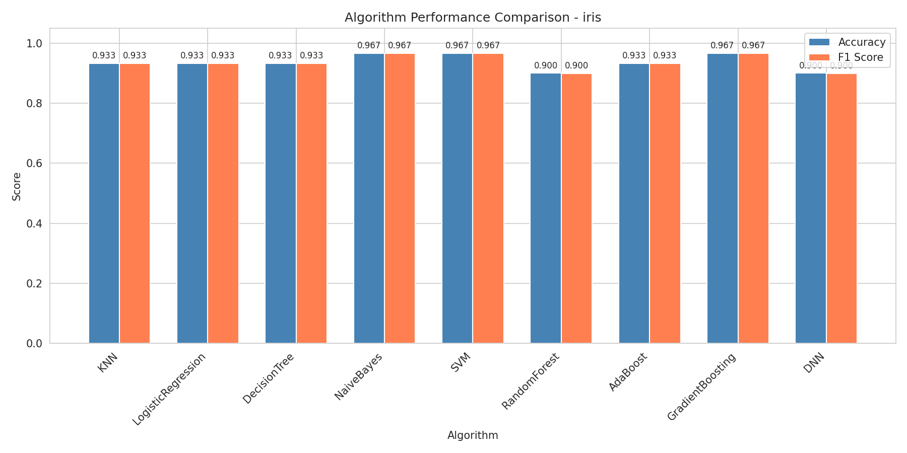
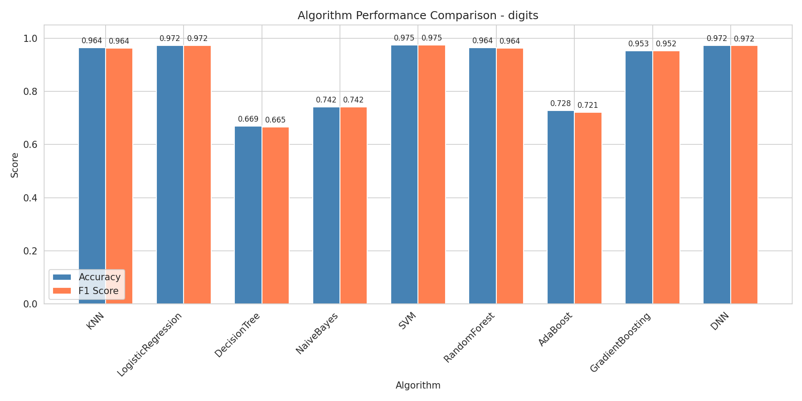
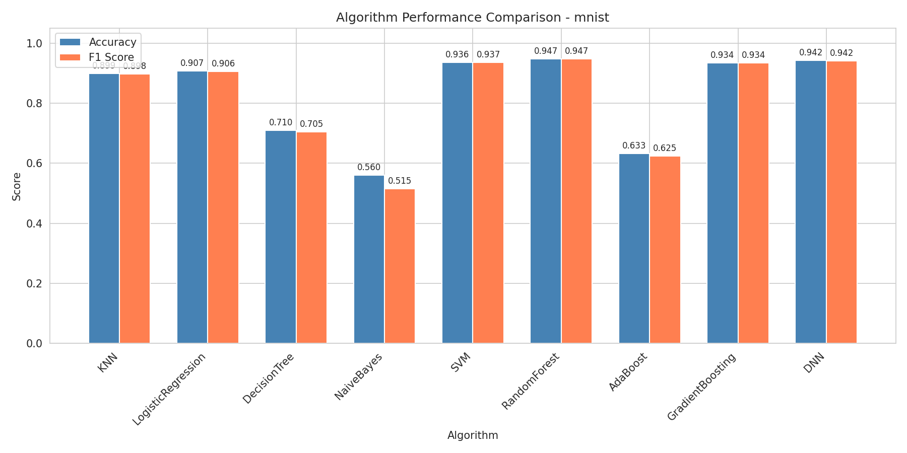
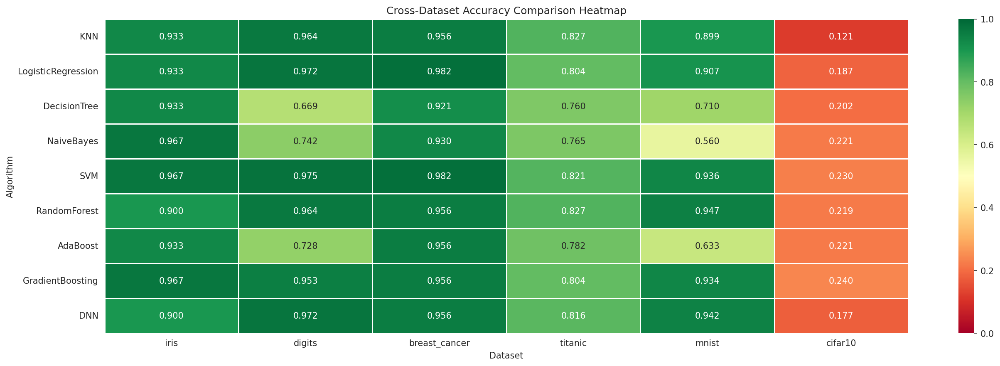

# 实验一：机器学习开发平台搭建与算法测试 实验报告

## 一、实验环境搭建

**操作系统：** Windows 11 + WSL2 (Ubuntu 24.04)

**Python 环境：** Python 3.9.25，使用 `uv` 管理的虚拟环境（`.venv`）

**GPU 环境：** NVIDIA GeForce RTX 3050 Ti Laptop (4GB)，CUDA 13.2 驱动 + nvidia-cuda-toolkit 12.0

**依赖库清单：**

|类别|库名|
|-|-|
|科学计算|numpy, scipy, pandas|
|可视化|matplotlib, seaborn|
|传统机器学习|scikit-learn, xgboost, lightgbm|
|深度学习|tensorflow 2.20|
|GPU 工具链|nvidia-cuda-toolkit 12.0, CUDA 驱动 13.2|

**环境搭建遇到的问题与解决：**

1. **Windows PATH 污染 WSL2 环境。** WSL2 自动挂载 Windows C 盘并合并 PATH，导致 TensorFlow 扫描到 Windows 侧 CUDA 13.1 的 `nvlink`/`ptxas`，与 WSL2 内 CUDA 13.2 驱动冲突。解决：在代码中过滤 `/mnt/c/` 路径。
2. **缺少 CUDA 编译工具链。** WSL2 默认只安装显卡驱动，不含 `ptxas`、`nvlink`、`libdevice.10.bc` 等 CUDA 开发文件，TensorFlow XLA 编译器无法编译 GPU kernel。解决：`sudo apt install nvidia-cuda-toolkit` 安装完整 CUDA 12.0 工具链。
3. **XLA 找不到 libdevice.10.bc。** 系统安装路径 `/usr/lib/nvidia-cuda-toolkit/libdevice/` 不在 XLA 的默认搜索路径中。解决：在实验目录创建软链接 `ln -s /usr/lib/nvidia-cuda-toolkit/libdevice/libdevice.10.bc .`。
4. **Titanic 数据集下载失败。** HTTPS 代理拦截导致 SSL 错误。解决：改用 seaborn 内置 Titanic 数据集。

\---

## 二、算法实现

实验共实现并测试 **9 种算法**，涵盖四大类：

|类别|算法|核心参数|
|-|-|-|
|线性模型|LogisticRegression|max\_iter=1000|
|距离/概率|KNN (KNeighborsClassifier)|n\_neighbors=5|
|距离/概率|GaussianNB|默认参数|
|树模型|DecisionTreeClassifier|max\_depth=5|
|树模型|RandomForestClassifier|n\_estimators=100|
|树模型|AdaBoostClassifier|n\_estimators=50|
|树模型|GradientBoostingClassifier|n\_estimators=100|
|核方法|SVM (SVC)|kernel='rbf'|
|深度学习|DNN (Sequential)|128→Dropout(0.3)→64→Dropout(0.3)→Softmax, Adam, max 50 epochs + EarlyStopping|

传统算法使用 80/20 训练/测试划分 + StandardScaler 标准化评估。DNN 使用额外的 10% validation split + EarlyStopping + ReduceLROnPlateau。

**数据预处理：** 标准化 + 对 CIFAR-10（3072 维）使用 PCA 降至 200 维控制运算时间。MNIST（784 维）保留全维度。

\---

## 三、实验结果

### 3.1 算法精度对比（各数据集）

### 3.2 完整 Accuracy 对比

|算法|iris|digits|breast\_cancer|titanic|mnist|cifar10|
|-|-|-|-|-|-|-|
|KNN|0.9333|0.9639|0.9561|**0.8268**|0.8990|0.1250|
|LogisticRegression|0.9333|0.9722|**0.9825**|0.8045|0.9070|0.2030|
|DecisionTree|0.9333|0.6694|0.9211|0.7598|0.7100|0.1990|
|NaiveBayes|**0.9667**|0.7417|0.9298|0.7654|0.5600|0.2370|
|SVM|**0.9667**|**0.9750**|**0.9825**|0.8212|0.9360|0.2280|
|RandomForest|0.9000|0.9639|0.9561|**0.8268**|**0.9470**|0.2290|
|AdaBoost|0.9333|0.7278|0.9561|0.7821|0.6330|0.2280|
|GradientBoosting|**0.9667**|0.9528|0.9561|0.8045|0.9340|**0.2400**|
|DNN|0.8333|0.9639|0.9649|0.8212|0.9420|0.1960|

### 3.2 训练时间对比（秒）

|算法|iris|digits|breast\_cancer|titanic|mnist (784维)|cifar10 (200维)|
|-|-|-|-|-|-|-|
|KNN|0.001|0.001|0.001|0.001|0.002|0.002|
|LogisticRegression|0.002|0.097|0.006|0.004|1.434|0.668|
|DecisionTree|0.001|0.011|0.006|0.001|0.492|0.354|
|NaiveBayes|0.001|0.002|0.001|0.001|0.048|0.006|
|SVM|0.002|0.202|0.008|0.040|8.887|5.968|
|RandomForest|0.087|0.241|0.140|0.127|5.080|5.153|
|AdaBoost|0.050|0.152|0.118|0.064|3.947|3.714|
|GradientBoosting|0.205|5.411|0.453|0.109|**157.5**|**154.0**|
|DNN (GPU)|11.03|11.42|8.80|7.01|30.69|19.65|

### 3.4 各数据集最佳算法

|数据集|样本数|特征数|类别数|最佳算法|Accuracy|F1|
|-|-|-|-|-|-|-|
|iris|150|4|3|NaiveBayes / SVM / GBDT|0.9667|0.9666|
|digits|1797|64|10|SVM|0.9750|0.9749|
|breast\_cancer|569|30|2|LogisticRegression / SVM|0.9825|0.9825|
|titanic|891|10|2|KNN / RandomForest|0.8268|0.8255|
|mnist|5000|784|10|RandomForest|0.9470|0.9472|
|cifar10 (PCA200)|5000|3072→200|10|GradientBoosting|0.2400|0.2346|

\---

## 四、结果分析

**1. 小规模标准数据集（iris、breast\_cancer、digits）：所有算法表现优秀（acc > 90%）。**

* iris（150 样本，4 维）：NaiveBayes / SVM / GBDT 并列 96.67%。DNN 最差（83.33%），因为 150 个样本对神经网络太少。
* breast\_cancer（569 样本，30 维）：LogisticRegression 和 SVM 并列 98.25%，线性可分性很好。
* digits（1797 样本，64 维）：SVM 最佳 97.50%。DecisionTree（66.94%）和 NaiveBayes（74.17%）偏低，特征间存在强关联。

**2. Titanic（891 样本，10 维）：各算法差异不大（76%–83%），数据信号本身是上限。**

**3. MNIST（784 维，全维度）：去掉 PCA 后准确率飙升。**

|算法|PCA 100 维|全量 784 维|提升|
|-|-|-|-|
|KNN|0.1680|0.8990|+73.1%|
|SVM|0.4830|0.9360|+45.3%|
|RandomForest|0.5960|**0.9470**|+35.1%|
|DNN|0.4850|0.9420|+45.7%|

784 维全量 + RandomForest 达到 94.70%，说明图像数据的信息损失与维度压缩成正相关。

**4. CIFAR-10（PCA 200 维）：最高仅 24%。** 3072 维降到 200 维损失了过多空间信息。该任务应使用 CNN 从原始图像学习，PCA 线性降维不适用于自然图像。

**5. 训练时间：** GradientBoosting 在大规模数据上极慢（MNIST/CIFAR-10 \~150s），因其串行训练 100 棵树的代价高。DNN 利用 GPU 加速稳定在 10–30s。KNN/NaiveBayes 训练几乎瞬时。

\---

## 五、实验总结

**关键技术难点：**

1. WSL2 环境下 CUDA 工具链的完整配置是最大障碍：驱动安装、Toolkit 安装、XLA 编译器路径对齐三者缺一不可。
2. 高维数据使用 PCA 降维必须平衡信息保留和计算效率——MNIST 从 100→784 维带来 35%–73% 的提升，说明过度降维也代价巨大。

**收获：**

1. 建立了一套标准化的 ML 算法对比流程：数据加载 → 预处理 → 多算法评估 → 可视化 → 分析总结。
2. 直观理解"没有银弹"——不同算法在不同数据特性上各有优势，特征工程（PCA 决策）对最终结果的影响不亚于算法选择。

**改进方向：**

1. CIFAR-10 应使用 CNN 而非 PCA+传统分类器。
2. 补全 Windows 原生环境测试获取跨平台对比数据。
3. 增加 GridSearchCV 超参数搜索让算法在最优参数下比较。
4. 记录 GPU 显存和系统内存使用完善资源消耗评估。

