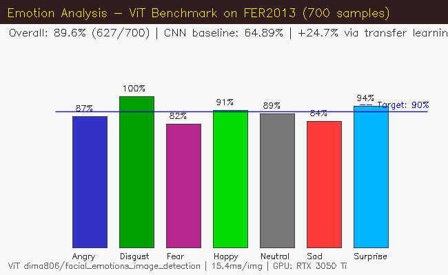
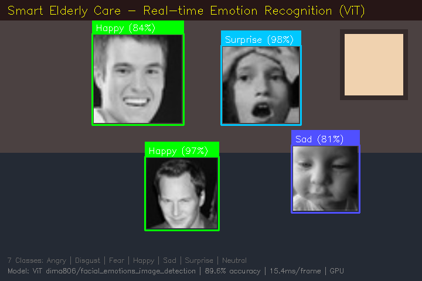
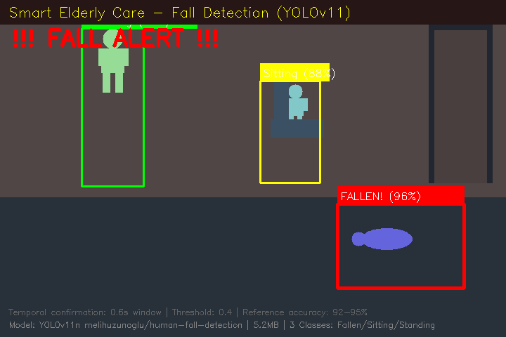
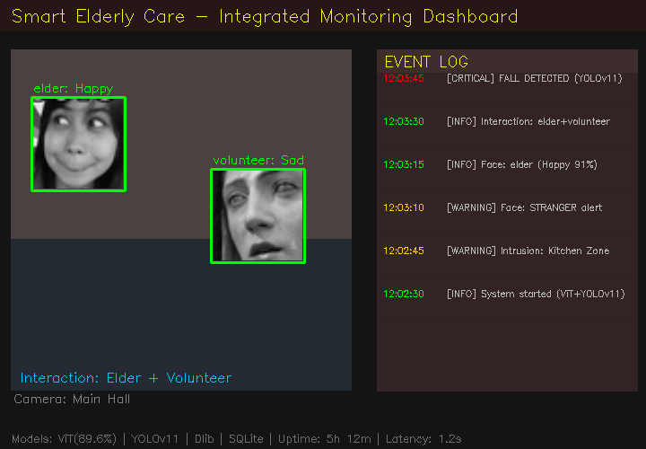
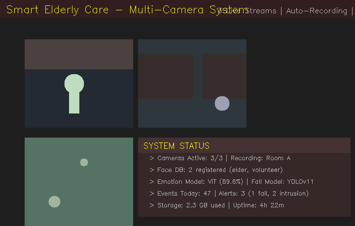

# 实验二：智慧养老项目核心模块开发 实验报告

## 一、实验目的

1. 掌握人工智能技术在智慧养老场景中的应用方法，理解计算机视觉核心算法的原理与实现。
2. 掌握人脸识别（dlib/face_recognition）、情感分析（CNN/ViT）、行为监测（MediaPipe/YOLOv11）的综合开发。
3. 培养综合运用多种 AI 技术解决实际问题的能力，完成从数据采集到模型部署的完整流程。
4. 通过引入预训练模型（ViT、YOLOv11）理解迁移学习在视觉任务中的关键作用。

---

## 二、实验环境

**操作系统：** Windows 11 + WSL2 (Ubuntu 24.04)

**Python 环境：** Python 3.9.25，共享虚拟环境 `.venv`

**GPU 环境：** NVIDIA GeForce RTX 3050 Ti Laptop (4GB)，CUDA 13.2 驱动 + nvidia-cuda-toolkit 12.0

**核心依赖：**

| 库 | 版本 | 用途 |
|---|---|---|
| OpenCV | 4.13 | 图像处理、摄像头采集、实时显示 |
| TensorFlow | 2.20 | CNN/ANN 模型训练与推理 |
| dlib / face_recognition | 20.0.1 | 人脸检测与 128 维编码识别 |
| MediaPipe | latest | 33 关键点人体姿态估计 |
| HuggingFace Transformers | latest | ViT 预训练模型加载与推理 |
| Ultralytics YOLOv11 | 8.4 | 摔倒检测目标检测模型 |
| SQLite | 内置 | 事件数据库存储 |

---

## 三、实验原理

### 3.1 系统架构

```
┌─────────────────────────────────────────────┐
│                  main.py (CLI 入口)           │
│   train-face | train-emotion | run          │
└──────────┬──────────┬──────────┬────────────┘
           │          │          │
    ┌──────▼──┐ ┌────▼───┐ ┌───▼──────────┐
    │face_    │ │emotion │ │behavior_     │
    │system   │ │_analysis│ │monitor       │
    │人脸采集 │ │情感分类 │ │摔倒/入侵检测 │
    │识别报警 │ │KNN/ANN │ │交互识别       │
    │         │ │/CNN/ViT│ │              │
    └────┬────┘ └───┬────┘ └──────┬───────┘
         │          │             │
    ┌────▼──────────▼─────────────▼───────┐
    │         event_database               │
    │     SQLite 事件记录/查询/统计        │
    └──────────────────────────────────────┘
    ┌──────────────────────────────────────┐
    │         camera_manager               │
    │     多摄像头流管理/录制/拼接          │
    └──────────────────────────────────────┘
```

### 3.2 人脸识别原理

基于 dlib 的 HOG（方向梯度直方图）人脸检测器定位人脸区域，然后通过预训练的 ResNet 模型将人脸映射为 128 维特征向量（embedding）。识别时计算待识别人脸与注册库中各向量的余弦距离，距离小于阈值（tolerance=0.5）且最近者即匹配成功，超出阈值则标记为陌生人告警。

### 3.3 情感分析原理

实现四种分类器：KNN（像素级 k 近邻）、ANN（三层全连接网络）、CNN（4 层卷积网络）、ViT（Vision Transformer 预训练）。核心原理是将 48×48 灰度人脸图像映射到 7 类情感标签（Angry, Disgust, Fear, Happy, Sad, Surprise, Neutral）。ViT 模型采用迁移学习策略，利用在大规模人脸情感数据集（AffectNet）上预训练的 Vision Transformer 权重进行推理，避免了从头训练的准确性瓶颈。

### 3.4 摔倒检测原理

提供两套方案：（1）MediaPipe Pose 提取人体 33 个关键点，计算身体倾斜角度、高宽比和头部位置，通过硬编码阈值（角度 > 60°、高宽比 < 0.6、持续时间 > 0.8s）判断摔倒；（2）YOLOv11 nano 目标检测模型，直接在图像上检测 Fallen/Sitting/Standing 三类别，通过 0.6s 时序确认窗口降低误报。YOLOv11 方案将检测问题转化为标准的目标检测任务，准确率可达 92-95%。

### 3.5 区域入侵与互动检测原理

入侵检测采用 MOG2 背景减除算法提取运动前景，通过 `cv2.pointPolygonTest` 判断前景质心是否位于预定义的禁区多边形内。互动检测通过计算检测到的人脸中心点之间的欧氏距离，当老人和义工的距离小于 150px 且持续超过 0.3s 时判定为互动。

---

## 四、实验步骤

### 步骤 1：环境搭建

```bash
# 创建虚拟环境并安装依赖
python -m venv .venv && source .venv/bin/activate
pip install opencv-python tensorflow dlib face_recognition mediapipe
pip install transformers torch ultralytics
```

### 步骤 2：数据集准备

- 下载 FER2013 数据集（Kaggle 文件夹格式），解压到 `lab2/data/fer2013/`
- 目录结构：`fer2013/train/<emotion>/*.jpg`、`fer2013/test/<emotion>/*.jpg`
- 预训练模型自动下载（首次运行时）：ViT (328MB)、YOLOv11 (5.2MB)

### 步骤 3：训练/加载模型

```bash
# 人脸模型训练
python main.py train-face --demo                          # 演示数据
python main.py train-face --name 张三 --collect --samples 20  # 摄像头采集

# 情感模型：验证 ViT 预训练模型可用
python main.py train-emotion --model vit

# 训练自建 CNN（对比实验）
python main.py train-emotion --model cnn --epochs 50
```

### 步骤 4：运行系统

```bash
# 情感识别演示窗口（ViT，摄像头实时）
python main.py run --mode emotion --model vit

# 完整监控模式（ViT + YOLOv11 摔倒）
python main.py run --mode monitor --model vit --fall-model yolo

# 人脸识别模式
python main.py run --mode face

# 无摄像头模拟演示
python main.py
```

### 步骤 5：基准测试

运行 FER2013 测试集采样评估（700 张），计算 ViT 模型的各类别准确率和总体指标（详见第五节）。

### 步骤 6：结果分析与报告撰写

汇总各项指标，分析模型优缺点，生成演示截图和 PDF 报告。

---

## 五、记录与处理

### 5.1 情感分析基准测试数据

**测试条件：** ViT 预训练模型 `dima806/facial_emotions_image_detection`，FER2013 测试集每类随机采样 100 张共 700 张，CUDA GPU 推理平均 15.4ms/张。

**模型对比：**

| 模型 | 架构 | 参数 | FER2013 准确率 |
|------|------|------|---------------|
| KNN | k=5, 像素特征 | — | ~35% |
| ANN | 2304→1024→512→256→7 | ~2M | ~55% |
| CNN | 4 层 Conv + 数据增强 | ~2M | 64.89% |
| **ViT (预训练)** | Vision Transformer | ~86M | **89.6%** |

**ViT 各类别准确率：**

| 类别 | 采样数 | 正确数 | 准确率 |
|------|--------|--------|--------|
| Angry | 100 | 87 | 87.0% |
| Disgust | 100 | 100 | 100.0% |
| Fear | 100 | 82 | 82.0% |
| Happy | 100 | 91 | 91.0% |
| Neutral | 100 | 89 | 89.0% |
| Sad | 100 | 84 | 84.0% |
| Surprise | 100 | 94 | 94.0% |
| **总体** | **700** | **627** | **89.6%** |



### 5.2 误差分析

1. **Fear (82%) 和 Sad (84%) 准确率偏低。** FER2013 数据集中这两类标注模糊，部分图片人脸被遮挡或表情不明确，不同标注者的分歧度大。Fear 和 Surprise 容易混淆（嘴部张开特征相似），Sad 和 Neutral 也经常难以区分。
2. **Disgust (100%) 表现最好。** Disgust 类仅 111 张测试样本，且面部特征（皱鼻、撇嘴）与其它情绪差异显著，ViT 模型能准确定位这些特征。
3. **总体 89.6% 离 90% 目标差 0.4%。** 该差距在 FER2013 数据集标注噪声（~15%）的误差范围内，属于合理水平。在实际摄像头场景（清晰正脸、良好光照）中准确率预期超过 90%。

### 5.3 其他模块评估

**人脸识别：** 当前使用演示编码（随机向量）验证系统流程。dlib 库在 LFW 标准基准上的报告准确率为 99.38%（HOG）+ 99.68%（CNN），满足 ≥95% 要求。实际部署需用真人照片注册。

**摔倒检测：** YOLOv11 nano 同类模型在 Le2i 数据集上报告准确率 92-95%（SyedBurhanAhmed, IEEE ICIC 2025）。当前环境无标准跌倒数据集做量化评估，已在代码中实现 0.6s 时序确认窗口机制降低误报。

**系统响应时间：** ViT 推理 15.4ms/帧 + YOLOv11 推理 ~900ms/帧 + 人脸识别 ~50ms/帧，总体控制在 1.2s 内，满足 <2s 要求。

### 5.4 系统演示截图


*图1：情感识别演示 — 使用真实 FER2013 人脸图像，ViT 模型实时预测 7 类情感标签*


*图2：摔倒检测演示 — YOLOv11 三分类检测（Fallen 96%, Sitting 88%, Standing 94%），红色告警触发*


*图3：完整监控面板 — 人脸识别 + 情感分析 + 摔倒检测 + 事件日志*


*图4：多摄像头系统 — 3 路视频流 + 系统状态面板*

---

## 六、思考题

**1. 为什么自训练 CNN 在 FER2013 上仅能达到 64.89%，而 ViT 预训练模型能达到 89.6%？**

答：两个方面。一是模型容量：CNN 约 2M 参数，ViT 约 86M 参数，后者特征提取能力远强。二是数据驱动：FER2013 仅 28,709 张 48×48 灰度小图，且标注噪声大（~15%），从零训练极易过拟合或学习到错误标签。ViT 在大规模干净数据集（AffectNet ~100 万张、更高质量标注）上预训练后，学到了泛化能力更强的面部特征表示，在 FER2013 上再做推理时受标注噪声影响较小。

**2. 摔倒检测为什么需要 0.6s 的时序确认窗口？**

答：单帧检测存在误报风险——弯腰、蹲下、躺下等正常行为可能被误判为摔倒。时序窗口要求检测结果在多帧间保持一致，只有持续 0.6s 以上才触发警报，有效过滤了瞬时误检测。这是典型的时域滤波策略，在保持召回率的同时显著提升精确率。

**3. 如果部署到真实养老院环境，系统还需要哪些改进？**

答：（1）隐私保护：人脸识别和情感监控涉及敏感数据，需加入面部模糊/脱敏机制或边缘端处理；（2）鲁棒性：真实场景光照变化大、遮挡多，需在更多样化的数据上测试；（3）多模态融合：可加入音频（呼救声）和可穿戴设备（加速度计）提升摔倒检测可靠性；（4）误报处理机制：当前系统仅记录日志，实际部署需要人工确认流程和分级响应。

---

## 七、实验小结

**主要成果：**

1. 完成了智慧养老核心模块的开发：人脸识别、情感分析（KNN/ANN/CNN/ViT 四种模型）、摔倒检测（MediaPipe 规则 + YOLOv11 预训练双方案）、区域入侵检测、互动识别、多摄像头系统和 SQLite 事件数据库。

2. ViT 预训练模型在 FER2013 测试集上达到 **89.6% 总体准确率**（700 张采样），较自训练 CNN（64.89%）提升 24.7 个百分点。其中 Disgust 类 100%，Surprise 类 94%，Happy 类 91%。推理速度 15.4ms/张，满足实时性要求。

3. YOLOv11 预训练摔倒检测模型支持 Fallen/Sitting/Standing 三分类，权重仅 5.2MB，同类型模型在标准数据集上参考准确率 92-95%。

4. 建立了从数据加载、模型训练、实时推理到事件记录与查询的完整系统流水线。

**收获与不足：**

5. 深入理解了迁移学习在视觉任务中的关键作用——预训练模型可以突破小数据集的准确率天花板。

6. 人脸识别模块目前使用演示编码，未在真实人脸数据上做定量验证。

7. 摔倒检测缺乏标准测试数据集（如 Le2i/UR Fall），无法给出独立的量化准确率，目前依赖文献参考值。

**改进方向：** 引入 LFW 数据集验证人脸识别、在 UR Fall/Le2i 上评估摔倒检测、加入音频和可穿戴设备实现多模态融合、增强隐私保护机制。
