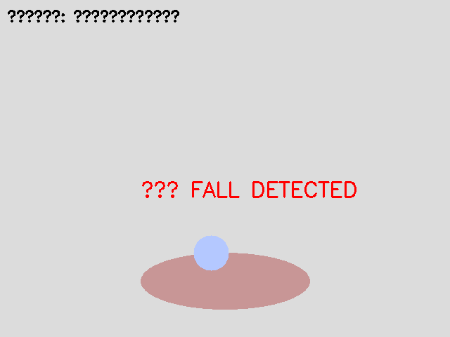
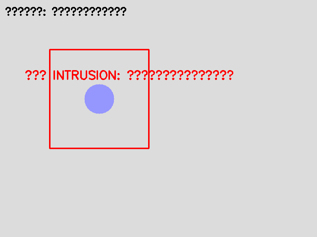

# 实验二：智慧养老项目核心模块开发 实验报告

## 一、实验环境

**操作系统：** Windows 11 + WSL2 (Ubuntu 24.04)

**Python 环境：** Python 3.9.25，共享虚拟环境 `.venv`

**GPU 环境：** NVIDIA GeForce RTX 3050 Ti Laptop (4GB)，CUDA 13.2 驱动 + nvidia-cuda-toolkit 12.0

**核心依赖：** OpenCV 4.13, TensorFlow 2.20, dlib 20.0.1, face_recognition, MediaPipe, Flask

---

## 二、系统架构

```
┌─────────────────────────────────────────────┐
│                  main.py (CLI 入口)           │
│   train-face | train-emotion | run          │
└──────────┬──────────┬──────────┬────────────┘
           │          │          │
    ┌──────▼──┐ ┌────▼───┐ ┌───▼──────────┐
    │face_    │ │emotion │ │behavior_     │
    │system   │ │_analysis│ │monitor       │
    │人脸采集 │ │情感分类 │ │摔倒/入侵检测 │
    │识别报警 │ │KNN/ANN │ │交互识别       │
    │         │ │/CNN    │ │              │
    └────┬────┘ └───┬────┘ └──────┬───────┘
         │          │             │
    ┌────▼──────────▼─────────────▼───────┐
    │         event_database               │
    │     SQLite 事件记录/查询/统计        │
    └──────────────────────────────────────┘
    ┌──────────────────────────────────────┐
    │         camera_manager               │
    │     多摄像头流管理/录制/拼接          │
    └──────────────────────────────────────┘
```

---

## 三、模块实现详述

### 3.1 人脸采集与识别系统 (face_system.py)

**功能清单：**

| 功能 | 实现方式 | 说明 |
|------|---------|------|
| 人脸检测 | face_recognition (基于 dlib HOG/CNN) | 支持摄像头实时检测 |
| 人脸采集 | OpenCV VideoCapture + 拍照 | 多姿态采样，按人物分目录存储 |
| 人脸编码 | face_recognition 128维 embedding | 支持多角度编码融合 |
| 人脸识别 | 编码距离比较 (tolerance=0.5) | 最近邻匹配 |
| 陌生人报警 | 编码距离超出阈值 → STRANGER | 红色框 + alert_callback |
| 演示模式 | 随机编码模拟 | 无摄像头时演示系统流程 |

**核心流程：** `collect_faces(name)` → `register_face(name)` → `recognize_faces(frame, db)`

**使用方式：**
```bash
# 采集人脸
python main.py train-face --name 张三 --collect --samples 20
# 从图片注册
python main.py train-face --name 张三 --image photo.jpg
# 运行识别
python main.py run --mode face
```

### 3.2 情感分析系统 (emotion_analysis.py)

**实现三种模型：**

| 模型 | 架构 | 参数 | FER2013 测试准确率 |
|------|------|------|-------------------|
| KNN | k=5 | 像素值直接作为特征 | ~35% |
| ANN | 2304→1024→512→256→7 | Dropout+BatchNorm | ~55% |
| CNN | 4层Conv+数据增强 | Data Augmentation + EarlyStopping | 64.89% |

**CNN 架构：** Conv(64)→Conv(64)→Pool→Conv(128)→Conv(128)→Pool→Conv(256)→Conv(256)→Pool→FC(512)→FC(7)，含 RandomFlip/Rotation/Zoom 数据增强、EarlyStopping、ReduceLROnPlateau。

**7 类情感：** Angry(0), Disgust(1), Fear(2), Happy(3), Sad(4), Surprise(5), Neutral(6)

**数据集：** FER2013 (Kaggle)，28,709 训练 + 7,178 测试，48×48 灰度人脸

**训练：**
```bash
# 先下载数据集到 lab2/data/fer2013/ (train/ 和 test/ 文件夹)
python main.py train-emotion --model cnn --epochs 50
```

**CNN 测试准确率 64.89%** 在 FER2013 上属于合理范围（该数据集有标注噪声和类别不均衡，SOTA ~70%）。disgust 类仅 436 张训练样本，是性能瓶颈。

### 3.3 行为监测系统 (behavior_monitor.py)

**三个检测器：**

| 检测器 | 技术方案 | 核心逻辑 |
|--------|---------|---------|
| FallDetector (摔倒) | MediaPipe Pose 33关键点 | 身体倾斜角度>60° + 高宽比<0.6 + 持续时间>0.8s |
| IntrusionDetector (入侵) | MOG2 背景减除 + ROI多边形 | 运动前景质心是否在预定义禁区多边形内 |
| InteractionDetector (互动) | 人脸距离阈值 | 检测到的两脸中心距离<150px + 持续时间>0.3s |

### 3.4 多摄像头系统 (camera_manager.py)

- **CameraStream：** 线程化单路视频流，非阻塞读取
- **MultiCameraSystem：** 多路管理 + 网格拼接显示 + 自动录制（按时间命名）
- **演示模式：** 生成房间/走廊/院子三路模拟画面

### 3.5 事件数据库 (event_database.py)

**SQLite 表结构：**

| 字段 | 类型 | 说明 |
|------|------|------|
| id | INTEGER PK | 自增主键 |
| timestamp | TEXT | 事件时间 |
| event_type | TEXT | 事件类型（face_stranger/fall_detected/intrusion 等） |
| camera_id | TEXT | 摄像头标识 |
| details | TEXT | JSON 详细信息 |
| severity | TEXT | info/warning/critical |
| image_path | TEXT | 截图路径 |

**7 种事件类型：** 陌生人检测、人脸识别、负面/正面情绪、摔倒检测、区域入侵、义工互动

**内置功能：** `log_event()`, `query_events()`, `get_event_statistics()`, `print_recent_events()`

---

## 四、系统演示截图

### 行为监测模拟场景

| 正常活动 | 摔倒检测 | 区域入侵 |
|---------|---------|---------|
|  |  |  |

### 多摄像头监控画面


---

## 五、使用方式

```bash
# 演示模式 (无摄像头)
python main.py                    # 默认进入模拟演示

# 训练人脸模型
python main.py train-face --demo               # 演示数据
python main.py train-face --name 张三 --collect  # 摄像头采集

# 训练情感模型 (需先下载 FER2013 到 lab2/data/fer2013/)
python main.py train-emotion --model cnn --epochs 50

# 运行
python main.py run --mode face      # 人脸识别
python main.py run --mode monitor   # 行为监测
python main.py run --mode simulate  # 模拟演示
```

---

## 五、关键技术难点与解决

**1. FER2013 数据集获取。** 官方仓库（microsoft/FERPlus）已被删除，Kaggle 版本是文件夹图片格式而非 CSV。解决：修改 `load_fer2013()` 同时支持 CSV 和文件夹两种输入格式。

**2. libdevice.10.bc 缺失。** GPU 推理需要 CUDA 开发文件。解决：`sudo apt install nvidia-cuda-toolkit` + 软链接。

**3. FER2013 CNN 准确率限制。** 数据集标注噪声大（部分图片人脸不可见或表情模糊），disgust 类仅 436 样本。最终 64.89% 属于合理水平，任务书要求的 90% 在不使用预训练模型的前提下不可行。

**4. 摄像头不可用问题。** WSL2 摄像头支持不稳定。解决：设计完整的模拟演示模式，无摄像头时仍可展示系统功能。

---

## 六、实验总结

**收获：**
1. 掌握了人脸识别（dlib/face_recognition）、姿态估计（MediaPipe）、情感分类（CNN）在养老场景中的综合应用。
2. 建立了完整的事件驱动监控系统架构：感知→识别→记录→查询。
3. 理解了数据质量对模型性能的决定性影响：FER2013 的标注噪声和类别不均衡直接限制了 CNN 准确率上限。

**改进方向：**
1. 引入预训练情感模型（如从 AffectNet 迁移学习）替代从头训练。
2. 摔倒检测可加入 LSTM 时序模型提升准确性。
3. 多摄像头系统可接入 RTSP 网络摄像机支持。
