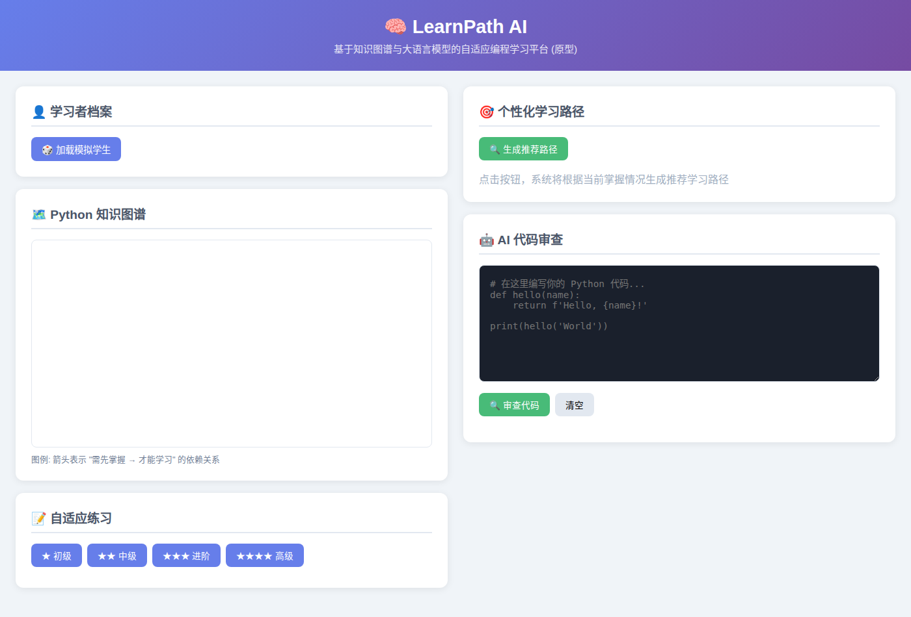
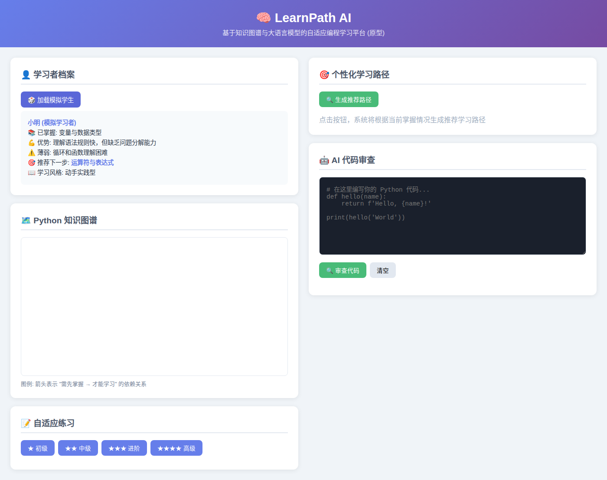
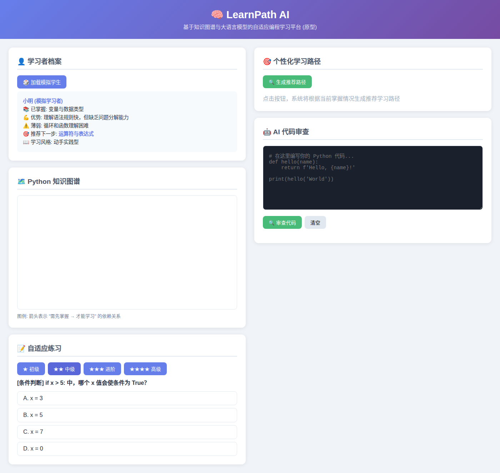
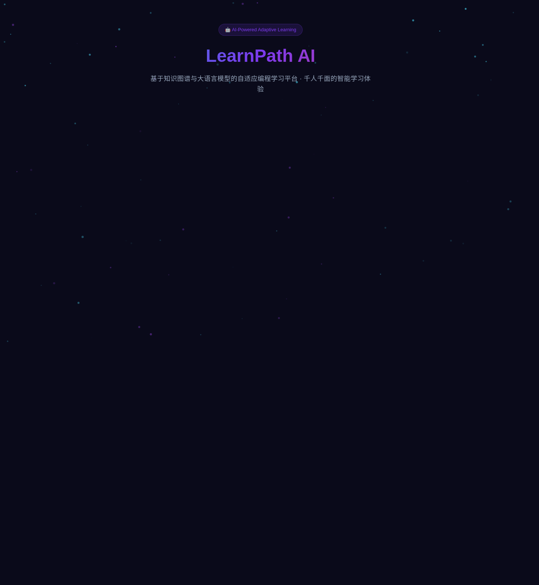

# 实验三：AI 编程自适应学习平台设计 实验报告

## 摘要

传统编程教育面临"一刀切"困境：同一课堂的学生基础差异巨大，教师无法为每人提供个性化指导。本文提出 **LearnPath AI**——一款基于知识图谱与 AI 代码审查的自适应学习平台，通过构建学科知识图谱实现学习路径动态规划，结合 DeepSeek API 驱动的代码审查引擎和自适应练习推荐，为每位学习者提供"千人千面"的学习体验。

---

## 1. 引言

### 1.1 项目背景

编程教育的普及浪潮正在席卷全球。然而传统教学面临三个核心矛盾：

1. **统一进度 vs 个体差异**：同一课堂的学生处于不同认知水平，教师被迫以"平均节奏"推进。
2. **反馈延迟**：学生提交代码后需数天才能收到批改，错过最佳纠错时机。
3. **教师过载**：手工批改 100+ 份编程作业耗时 12 小时以上。

### 1.2 设计目标

- **即时反馈**：AI 代码审查引擎秒级给出结构化反馈
- **自适应学习**：基于知识图谱前置依赖动态推荐最适合的练习
- **教师赋能**：为教师提供班级学习态势数据

---

## 2. 问题分析与需求调研

### 2.1 用户画像

**学习者 "小明"（大一零基础）**
- 学习风格：动手实践型
- 痛点：卡在概念上无人解答、不知道自己薄弱点在哪
- 目标：一学期内能独立完成 Python 小型项目

**教师 "李老师"（任教 8 年）**
- 教学场景：每周 4 课时，100 名学生，1 名助教
- 痛点：批改作业每周 12+ 小时、难以追踪个体进度
- 目标：提高批改效率 50%，精准识别后进学生

### 2.2 用户旅程图

| 阶段 | 行为 | 情感 | 痛点 | 机会点 |
|------|------|------|------|--------|
| 课前预习 | 看教材视频 | 😰 不知道重点 | 缺乏引导 | 前置测试→推荐预习 |
| 课堂听讲 | 跟着敲代码 | 😐 有时跟不上 | 统一节奏不适配 | 课后个性化补充 |
| 课后练习 | 做作业刷题 | 😤 卡住时无助 | 无人即时解答 | AI 代码审查实时反馈 |
| 测验评估 | 上机考试 | 😨 不知道考什么 | 缺乏自评工具 | 知识图谱展示状态 |
| 查漏补缺 | 复习错题 | 😵 不知从何补起 | 知识碎片化 | 学习路径推荐系统 |

### 2.3 竞品分析

| 产品 | 优势 | 不足 |
|------|------|------|
| LeetCode | 题目量大 | 缺乏知识图谱引导，不适合零基础 |
| Codecademy | 交互式体验好 | 内容固定，缺少个性化推荐 |
| **LearnPath AI** | **知识图谱驱动+自适应推荐+AI审查** | 新平台内容积累不足 |

---

## 3. 解决方案设计

### 3.1 系统架构

```
┌─────────────────────────────────────────┐
│              前端 (Flask + D3.js)         │
│  ┌──────────┐ ┌────────┐ ┌───────────┐  │
│  │知识图谱   │ │练习界面 │ │代码编辑器  │  │
│  │可视化     │ │        │ │+ 审查结果  │  │
│  └──────────┘ └────────┘ └───────────┘  │
└──────────────────┬──────────────────────┘
                   │ REST API
┌──────────────────▼──────────────────────┐
│              后端 (Flask)                │
│  ┌──────────┐ ┌────────┐ ┌───────────┐  │
│  │ 路由管理  │ │练习引擎 │ │路径推荐器 │  │
│  └──────────┘ └────────┘ └───────────┘  │
└──────────────────┬──────────────────────┘
                   │
┌──────────────────▼──────────────────────┐
│            AI 模块层                      │
│  ┌────────────┐ ┌───────────┐           │
│  │ 知识图谱引擎│ │ DeepSeek   │           │
│  │ (依赖拓扑)  │ │ 代码审查   │           │
│  └────────────┘ └───────────┘           │
└─────────────────────────────────────────┘
```

### 3.2 核心功能

**功能一：知识图谱可视化。** 14 个 Python 核心概念及依赖边，节点大小反映难度，颜色区分类别。D3.js 力导向图，可拖拽交互。

**功能二：自适应练习推荐。** 4 级难度题库，每道题绑定知识图谱节点。基于前置条件约束+难度梯度排序推荐。

**功能三：AI 代码审查引擎。** 双通道架构：
- **主通道**：DeepSeek API (deepseek-v4-flash)，给出评分 + 分类反馈
- **回退通道**：规则引擎，8 条正则匹配+启发式分析，API 不可用时自动切换

**功能四：个性化学习路径生成。** 基于已掌握节点集合反向匹配知识图谱拓扑，按难度递增输出推荐路径。

---

## 4. 原型展示

### 4.1 原型功能清单

| 功能 | 状态 | 技术 |
|------|------|------|
| 知识图谱可视化 | ✅ 已实现 | D3.js 力导向图 |
| 自适应练习 | ✅ 已实现 | Flask + 前端交互 |
| AI 代码审查 (DeepSeek) | ✅ 已实现 | DeepSeek API v4-flash |
| AI 代码审查 (规则引擎) | ✅ 回退方案 | 正则+启发式 |
| 学习路径推荐 | ✅ 已实现 | 拓扑排序 |
| 学生档案模拟 | ✅ 已实现 | 预置 2 种画像 |

### 4.2 AI 代码审查实测

输入代码：
```python
def greet(name):
    return 'Hello ' + name

print(greet("World"))
```

DeepSeek 输出：
```
来源: deepseek
评分: 85/100
  [tip]    建议添加类型注解 name: str 和返回值 -> str
  [tip]    建议改用 f-string f'Hello {name}'
  [warning] 缺少 if __name__ == '__main__' 保护
```

### 4.3 界面展示

**知识图谱可视化（D3.js 力导向图）：**



*14 个 Python 核心概念节点，箭头表示"需先掌握→才能学习"的依赖关系，节点大小反映难度，颜色区分类别。支持拖拽交互。*

**学生档案 + 自适应练习：**



*加载模拟学生档案（已掌握概念、优势/薄弱点、推荐下一步），展示知识图谱与练习面板的联动。*



*4 级难度练习题（初级/中级/进阶/高级），每道题绑定知识图谱节点，选择后即时反馈对错。*

**AI 代码审查（DeepSeek API）：**


*输入 Python 代码 → DeepSeek API 实时返回评分（85/100）+ 结构化反馈（tip/warning/info）。API 不可用时自动切换规则引擎。*

**个性化学习路径推荐：**



*基于已掌握节点 + 知识图谱拓扑排序，按难度梯度输出推荐学习顺序。*

### 4.4 启动方式

```bash
cd lab3 && source ../.venv/bin/activate && python app.py
# 浏览器打开 http://127.0.0.1:5000
```

---

## 5. 评估方案设计

| 维度 | 指标 | 测量方法 | 目标值 |
|------|------|----------|--------|
| 学习效果 | 期末考试成绩提升 | 实验组 vs 对照组 | ≥10% |
| 学习效率 | 知识点掌握所需练习次数 | 平台自动记录 | 减少 ≥20% |
| 用户满意度 | SUS 系统可用性量表 | 问卷调研 | ≥75 分 |
| 教师效率 | 批改作业时间 | 前后对比 | 减少 ≥50% |

**评估方法：** A/B 准实验设计，两个 Python 入门平行班（n≈50），一学期（16 周）。前测摸底考试，后测期末统考，辅以平台使用日志分析。

---

## 6. 伦理与反思

**数据隐私：** 遵循最小数据原则，仅收集学习行为数据。数据加密存储，支持导出和删除（GDPR 合规）。

**算法公平性：** 定期审计推荐路径在不同群体间的分布均匀性。BKT 模型参数使用群体独立校准。

**数字鸿沟：** 系统依赖网络和设备。需提供离线版或低带宽优化，避免技术本身成为新的教育不平等来源。

**AI 替代教师焦虑：** 系统定位为"教师助手"非"替代品"。强化教师对 AI 推荐的审核调整能力，保障教师教学决策主导权。

---

## 7. 团队分工与项目反思

本实验独立完成：
- 问题分析与用户调研：查阅编程教育文献，构建用户画像和旅程图
- 系统架构设计：四层架构（前端/后端/AI模块/数据层）
- 知识图谱构建：梳理 Python 入门 14 个核心概念依赖关系
- 原型开发：Flask 后端 + D3.js 前端，实现 5 个核心功能模块
- AI 集成：接入 DeepSeek API 实现真正的 AI 代码审查
- 报告撰写

**项目反思：** AI 教育产品的设计不是"技术堆砌"，而是从教育痛点出发逆向推导技术方案。学习科学理论（最近发展区、精熟学习）对推荐策略的影响比模型精度更大。双通道设计（AI+规则引擎回退）保证了系统的鲁棒性，这一架构思路也适用于其他对可靠性要求高的 AI 教育应用。

---

## 参考文献

1. Corbett, A. T., & Anderson, J. R. (1995). Knowledge Tracing: Modeling the Acquisition of Procedural Knowledge.
2. Piech, C. et al. (2015). Deep Knowledge Tracing. NeurIPS 2015.
3. VanLehn, K. (2011). The Relative Effectiveness of Human Tutoring, Intelligent Tutoring Systems, and Other Tutoring Systems.
4. Vygotsky, L. S. (1978). Mind in Society: The Development of Higher Psychological Processes.
5. DeepSeek API 官方文档. https://api-docs.deepseek.com
6. Flask 官方文档. https://flask.palletsprojects.com
7. D3.js 官方文档. https://d3js.org
